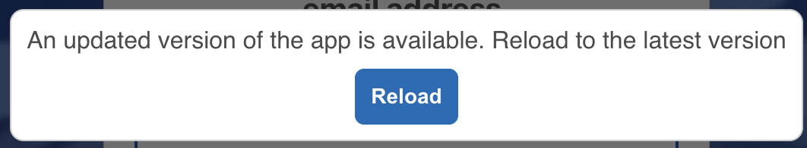

# App Refresh

This module renders a dialog to reload the application if there is a version update.

## Props

| Prop Name                 | Type     | Default Value      | Description                                   |
| ------------------------- | -------- | ------------------ | --------------------------------------------- |
| `label`                   | `string` | `''`               | Custom label for the dialog                   |
| `onClick`                 | `func`   | `null`             | Callback function triggered on button click   |
| `btnName`                 | `string` | `'Reload'`         | Text displayed on the reload button           |
| `currentVersion`          | `string` | `''`               | Current version of the application            |
| `fileName`                | `string` | `''`               | Name of the file to check for version updates |
| `dialogInactivityTimeout` | `number` | `180000` (3 mins)  | Timeout for dialog inactivity                 |
| `defaultAutoRefreshTime`  | `number` | `600000` (10 mins) | Frequency of version check API calls          |

## How It Works

1. The module makes an API call to `domain/${fileName}` every `defaultAutoRefreshTime` milliseconds.
2. Ensure this route exists in your backend app, or create a file in public folder during pre-build in node and returns an object in the format (application/json):

   ```json
   { "version": "x.y" }
   ```

   2.1 create a version file in public folder during pre-build in node

   ```javascript
   // scripts/pre-build.js
   const fs = require("fs");
   const path = require("path");

   // Read package.json
   const packageJsonPath = path.resolve(__dirname, "../package.json");
   const packageJson = JSON.parse(fs.readFileSync(packageJsonPath, "utf8"));

   // Extract version
   const buildVersion = packageJson.version;

   // Define the output file path
   const outputFilePath = path.resolve(
     __dirname,
     "../public/build-version.json"
   );

   // Write the version to the file
   fs.writeFileSync(
     outputFilePath,
     JSON.stringify({ version: buildVersion }, null, 2),
     "utf8"
   );

   console.log(`Build version written to ${outputFilePath}`);
   ```

   2.2 run the above script in prebuild, ending up creating the file in public folder.

   ```javascript
   "scripts": {
    "prebuild": "node scripts/pre-build.js"
    }
   ```

3. The module compares the received version from the api with the `currentVersion` prop from user's package.json version.
4. If there is a mismatch, a dialog appears prompting the user to reload the page.
   

## Usage

```jsx
<ReloadDialog
  currentVersion="1.0.0"
  fileName="version.json"
  btnName="Update Now"
  dialogInactivityTimeout={180000}
  defaultAutoRefreshTime={600000}
/>
```

Ensure your backend or node serves the version information at `domain/version.json` to support this functionality.
